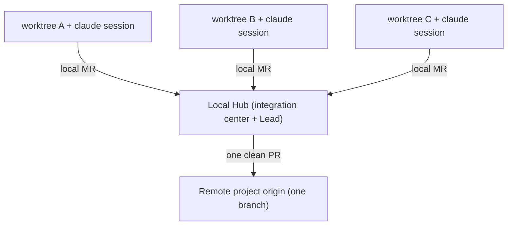

# BranchForge

**Run AI engineering teams in parallel branches.**

A Git-native Agentic Harness — let Claude agents work like a *whole engineering team*, in parallel, across isolated branches.

*From AI Coding to AI Teaming.*

---

## Why

AI shouldn't be just one developer. AI should be an entire engineering team.

Today's AI coding tools (Claude Code / Codex / Cursor …) can already write, debug, test, and refactor — yet they're all stuck at one fundamental limit:

> **One agent ≈ one developer**: serial, single workspace, single branch.

Even if you open several AI sessions at once, they still **share a working directory, overwrite each other's commits, and can't truly parallelize or integrate**. Fundamentally, many sessions are still just one developer.

The models are good enough. What's missing isn't a smarter AI — it's **software engineering infrastructure**: a **harness** that lets AI work like a team.

---

## What

BranchForge is a **Git-native Agentic Harness**: a runtime + workbench where one or more Claude agents work in **physically isolated git worktrees**, in parallel, toward a larger goal, integrate through **local Git**, and ship a single clean PR to the real project.

> **To the outside world it looks like one developer; inside, it's a whole engineering team.**

---

## Harness != Multi-agent collaboration

This is BranchForge's core design philosophy. We are **not** making a swarm of AIs chat with each other — we're **providing an environment where agents can work reliably**:

| | Multi-agent collaboration | **Agentic Harness** (BranchForge) |
|---|---|---|
| Focus | agents talking, negotiating | **providing environment / tools / constraints** so agents can work |
| Analogy | AutoGPT "AIs in a meeting" | **Kubernetes** — the environment & orchestration to run containers |
| Intelligence from | inter-agent dialogue (fragile) | environment mechanics (Git/MR/isolation) + human-in-the-loop |
| The human | a bystander waiting for AIs to agree | the **commander**, overseeing the runtime, intervening at will |

> Versus "spawning sub-agents inside one session": sub-agents are **threads** sharing the parent's context, ephemeral, dying with it. BranchForge workspaces are **processes** — each with its own context, durable, resumable, independently governable. One is multithreading; the other is a multi-process OS with a scheduler, a filesystem (git), and IPC.

---

## The core insight: Git kills physical zero-sum, but not semantic zero-sum

Worktree isolation eliminates **physical zero-sum** — two agents no longer overwrite each other's files. But:

> Agent A writes a backend `getUser(id)`; Agent B writes a frontend call `fetchUser(userId)`. `git merge` **succeeds** (no textual conflict) yet stitches together a semantically **broken** whole.

Git sees bytes, not meaning. That blind spot is **semantic zero-sum**. BranchForge closes it with two things:

- **Contract layer** — before fan-out, pin down checkable shared contracts (interfaces / schemas / shared tests). Tasks depend on the **contract**, not on each other → genuinely decoupled parallelism.
- **Verification inner loop** — `code -> run tests -> feed failures back -> fix -> until green`. "Done" is *proven by tests*, not claimed by the agent.

When a contract is expressed as a **shared test**, it becomes a gate inside the verification loop — so **semantic zero-sum gets caught automatically**. This is what separates BranchForge from "a pile of parallel agents."

---

## How: two-level Git

- **Two-level Git**: many worktrees -> local Hub integration -> one PR upstream. All the mess is digested locally; the remote stays clean.
- **Claude Agent SDK**: one headless `query()` session per worktree — own `cwd`, concurrent, resumable.
- **Three load-bearing pillars**: Contract layer (semantic zero-sum) · Verification loop (machine-checkable "done") · Integration self-heal (the merged whole must pass the gates).

---

## Status

**M1 — single-workspace runtime: PROVEN.** A real Claude session edits files inside an isolated worktree, produces a diff, with real billing (~$0.10). The core chain — *worktree isolation -> Agent SDK -> real edits -> diff* — works end to end.

| Milestone | Status |
|---|---|
| M1 Single-workspace runtime | Proven |
| M2 Verification loop (code-test-fix) | In progress |
| M3 Multi-workspace + cost/rate governance | Planned |
| M4 Contracts + integration self-heal | Planned |
| M5 UI shell (canvas, deferred) | Planned |

> Frontend strategy: **the CLI is the lightweight frontend for the diffusion phase**; the Electron canvas is deferred — core logic first.

---

## Docs

| Doc | Content |
|---|---|
| [Requirements](docs/REQUIREMENTS.md) | Domain model, architecture, MVP scope, auth |
| [Roadmap](docs/ROADMAP.md) | Overall plan + per-phase acceptance |
| [Contract Layer](docs/CONTRACT_LAYER.md) | Pillar #1: semantic zero-sum -> contracts |
| [Verification Loop](docs/VERIFICATION_LOOP.md) | Pillar #2: machine-checkable "done" |
| [Running / Handoff](docs/RUNNING.md) | Run it on a healthy machine + troubleshooting |
| [Development](docs/DEVELOPMENT.md) | Progress, code structure, constraints |

---

## Design principles

- **Git First** — models change (Claude / GPT / Gemini); Git doesn't (branch / merge / worktree). **The agent is replaceable; Git is not.**
- **Agent Agnostic** — backend is abstracted; codex / aider / gemini can plug in later.
- **Human-in-the-loop** — AI proposes, human decides. The human is the commander, not a bystander.

---

## License

Apache 2.0

AI doesn't need another IDE. AI needs a software engineering system.

